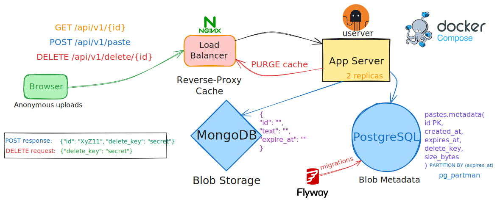

# pastebin
An online service for uploading text snippets and sharing links to them with others.<br>
Snippets are automatically deleted after some time (TTL).

<p align="center">

</p>

## Important notes
- Reads are much more frequent than creation of new blobs
- Blobs are immutable and are deleted rarely - perfect for **caching**
- Blob size limit is 1 MB to prevent abuse

#### Upload path (POST):
1. gen blob id = UUIDv4 + Base58 encoding without confusing characters (url-safe)
2. write blob to MongoDB
3. write metadata to Postgres
4. return unique link to client

<details>
<summary>What if something fails?</summary>

- Before blob write - blob not created. Nothing changes
- After blob write - blob created, metadata not. **Orphan blob** will eventually be purged by MongoDB TTL
</details>

#### Delete path (DELETE)
1. Delete Postgres metadata
2. Async MongoDB orphan blob delete
3. Async nginx cache purge

<details>
<summary>What if something fails?</summary>

- Metadata delete - nothing changes, respond code `500`
- Blob delete - **orphan blob** will stay but will eventually be purged by MongoDB TTL
- Cache purge - nginx will respond with content as if it wasn't deleted until cache becomes stale (at most 10min)
</details>

#### Read path (GET)
1. nginx cache?
2. cache miss:
    - read metadata from Postgres: exists/not expired?
	- read blob from MongoDB

## How to run
Run on Linux or WSL.
1. Build service binaries: `make build`
2. Deploy: `docker compose up --build -d`
    - Or you can try **e2e tests**: `make e2e-install && make e2e`

### Development
Development of services is done in **devcontainers**.<br>
Alternatively, run `cd paste-service && make docker-test-debug`
- Note: `docker-test-debug` aborts with `StackUsageMonitor` issues - either run container in privileged mode (see `.github/worflows/build-service.yml`) or use `devcontainers`

### Manual testing
1. Deploy the full infrastructure: `make build && docker compose up --build -d`
2. Test endpoints:
```bash
# Upload a paste, get "id" and "delete_key"
curl -v -X POST -H "Host: pastebin.io" -H "Content-Type: application/json" http://localhost/api/v1/paste -d '{"text": "YOUR_TEXT"}'

# Get paste, including metadata
curl -v -H "Host: pastebin.io" http://localhost/api/v1/YOUR_ID

# Delete a paste by providing both its id and a secret delete key
curl -v -X DELETE -H "Host: pastebin.io" -H "Content-Type: application/json" http://localhost/api/v1/delete/YOUR_ID -d '{"delete_key": "YOUR_KEY"}'
```