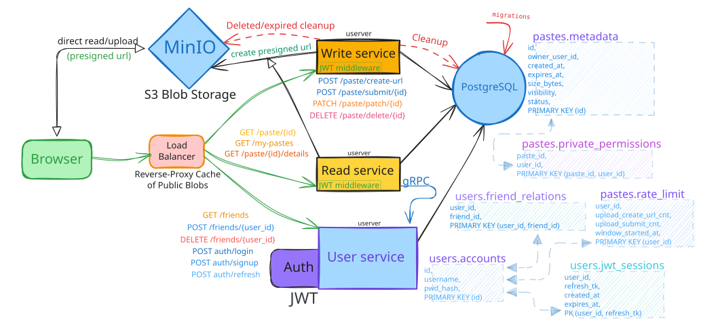

# pastebin
An online service for uploading text snippets and sharing links to them with others.<br>
Snippets are automatically deleted after some time (TTL).

<p align="center">

</p>

## Important notes
- Reads are much more frequent than creation of new blobs
- Blobs are **directly uploaded to/downloaded from S3**, saving the backend from extra traffic
- Users can upload up to 10 pastes per hour - rate limit by `user_id`
- Blob size limit is 1 MB to prevent abuse
- This is a v2 of this project, adding JWT authentication, user rate limiting, S3

## Paste privacy
- Pastes support 3 privacy modes: `public`, `friends-only`, `private`.
- Users can grant pinpoint READ access to their private pastes
- Users can also mark other users as *friends* and use `friends-only` privacy mode for a paste
- *Friendship is unidirectional*: if a user marks you as a friend, you can read their pastes, but they cannot read yours, unless you friend them too

## Details
### Upload path (POST):
1. user requests `/create-url`
    - generate unique blob id = UUIDv4 + Base58 encoding without confusing characters (url-safe)
    - run a DB transaction:
        - check user's *rate limit*, increment rate count, create a new paste with `'pending'` status
        - apply user-provided privacy settings (rollback if input is invalid)
    - return `PUT` presigned-url to user
2. user uploads directly to S3
3. user requests `/submit`
    - get the latest VersionId from S3
    - perform trivial validations
    - save VersionId and `'submitted'` status
    - respond OK to user

<details>
<summary>What if something fails?</summary>

- Crash before DB transaction in `/create-url`  -  blob id is discarded, nothing changes.
- Crash after DB transaction in `create-url`  -  user's `create-url` rate limit remains incremented, presigned url will expire in a few minutes, pending blob will be purged in 1 day
- If user doesn't upload anything  -  same as above ^^^
- Crash after saving blob and setting `'submitted'` status  -  submitted blob lives longer than pending in S3, but will be purged eventually
</details>

### Delete path (DELETE)
1. delete Postgres metadata
2. the async cleanup-job will purge orphan S3 content

### Read path (GET)
1. user requests `/{id}`
    - read metadata from Postgres: exists/not expired?
	- ensure user is allowed to read this
    - return `GET` presigned-url
2. user loads the paste directly from S3 with presigned-url

## How to run
Run on Linux or WSL.
1. Build service binaries: `make build-all`
2. Deploy: `docker compose up --build -d`
    - Or you can try **e2e tests**: `make e2e-install && make e2e-fresh`

### Development
Development of services is done in **devcontainers**.<br>
Alternatively, run `cd services/*-service && make docker-test-debug`
- Note: `docker-test-debug` aborts with `StackUsageMonitor` issues - either run container in privileged mode (see `.github/worflows/build-service.yml`) or use `devcontainers`

<details>
<summary>Manual Testing</summary>
1. Deploy the full infrastructure: `make build-all && docker compose up --build -d`
2. Test endpoints:

```bash
curl -v -X POST -H "Host: pastebin.io" -H "Content-Type: application/json" http://localhost/api/v2/auth/signup -d '{"username": "user", "password": "password"}' \
| grep access_tk

# EXPORT ACCESS TK
export test_access_tk=

# Upload paste step 1: create presigned url
curl -v -X POST -H "Host: pastebin.io" \
-H "Content-Type: application/json" \
-H "Authorization: Bearer $test_access_tk" \
-d '{}' \
http://localhost/api/v2/paste/create-url \
| grep presigned_url

# Upload paste step 2: upload to S3
read -p "enter presigned-url: " url && \
read -p "enter text: " text && \
curl -v -X PUT \
-H "Content-Type: application/octet-stream" \
-d "$text" \
"$url"

# Upload paste step 3: submit
read -p "Enter paste_id: " paste_id && \
curl -v -X POST -H "Host: pastebin.io" \
-H "Content-Type: application/json" \
-H "Authorization: Bearer $test_access_tk" \
-d '{"paste_id": "$paste_id"}' \
http://localhost/api/v2/paste/submit

# Get paste, including metadata
read -p "Enter paste_id: " paste_id && \
curl -v -H "Host: pastebin.io" \
-H "Authorization: Bearer $test_access_tk" \
http://localhost/api/v2/paste/$paste_id

# Delete a paste
read -p "Enter paste_id: " paste_id && \
curl -v -X DELETE -H "Host: pastebin.io" \
-H "Content-Type: application/json" \
-H "Authorization: Bearer $test_access_tk" \
http://localhost/api/v2/paste/delete/$paste_id
```
</details>